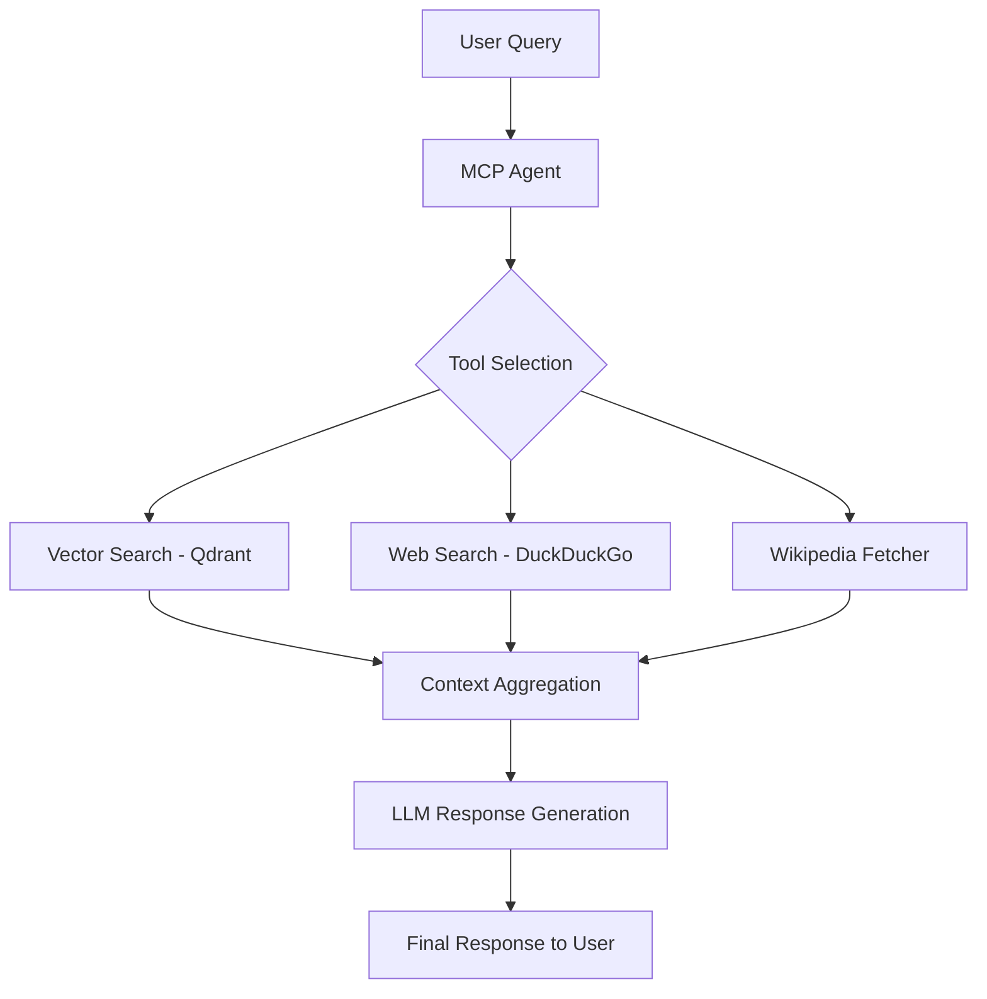

# 🚀 Agentic RAG System using MCP

An **Agentic Retrieval-Augmented Generation (RAG)** application powered by the **Model Context Protocol (MCP)**, enabling seamless integration of custom AI tools inside Cursor, VS Code, and other MCP-compatible environments.

## 🧩 Tech Stack

- **Python**: Core logic and MCP server implementation.
- **Model Context Protocol (MCP)**: For tool discovery and execution.
- **Qdrant (Vector Database)**: High-performance vector storage for RAG.
- **LlamaIndex**: Framework for connecting LLMs with external data.
- **HuggingFace Embeddings**: For converting text to semantic vectors.
- **DuckDuckGo Search**: Free, real-time web search integration.
- **Wikipedia**: Direct factual knowledge retrieval.

## ⚙️ Setup Instructions

### 1️⃣ Start Qdrant (Vector Database)

Ensure Docker is installed and running, then execute:

```bash
docker run -p 6333:6333 -p 6334:6334 -v qdrant_storage:/qdrant/storage:z qdrant/qdrant
```

### 2️⃣ Install Dependencies

Using `uv` for fast dependency management and project synchronization:

```bash
uv add -r requirements.txt
```

Alternatively, to add specific packages:

```bash
uv add mcp duckduckgo-search wikipedia requests llama-index qdrant-client llama-index-embeddings-huggingface python-dotenv
```

### 3️⃣ Configure MCP Server in Cursor

Go to: `Cursor/Antigravity/VSCode → Settings → MCP Servers → Add New`

#### 📌 Add the following in your MCP configuration:

```json
{
  "mcpServers": {
    "mcpRAG": {
      "command": "path/to/uv",
      "args": [
        "--directory",
        "absolute/path/to/projectdir",
        "run",
        "server2.py"
      ]
    }
  }
}
```

> [!NOTE]
> - Use `which uv` (Mac/Linux) or `where uv` (Windows) to find your `path/to/uv`.
> - Replace `absolute/path/to/projectdir` with the full path to this repository on your machine.

## ✅ Available Tools

Once the MCP server is green, the following tools will be available:

- `faq_retrieval_tool`: Retrieves the most relevant documents from the F1 Racing FAQ collection.
- `free_web_search_tool`: Performs real-time web searches using DuckDuckGo (Free, no API key required).
- `fetch_wikipedia_summary`: Fetches summaries of topics, historical events, or famous people directly from Wikipedia.

## 💬 Usage Examples

1. **Internal Knowledge**: "Search F1 FAQs about DRS rules."
2. **Real-time News**: "What is the latest news about the 2024 F1 season?"
3. **Factual Research**: "Who won the IPL in 2023?" (Uses Wikipedia/Web Search).

## 🧠 Architecture



## 📌 Notes

- This version uses **completely free** search tools (DuckDuckGo & Wikipedia), replacing the need for paid proxies like Bright Data.
- Ensure Qdrant is running before interacting with the FAQ tool.
- The `rag2.py` script handles data ingestion and vectorization logic.

## ⭐ Future Improvements

- Automated document ingestion pipeline.
- Multi-modal support for image search.
- Enhanced agent memory and conversation history.
- Web UI for monitoring tool calls and RAG performance.
